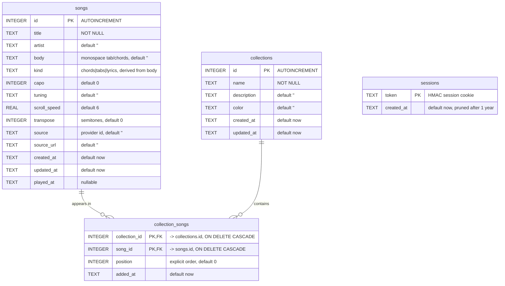

# OpenTabs 🎸

Your own open-source tab and chords library: store your tabs, read them with
autoscroll on your phone, search and import from online sources, self-host it
anywhere. Built as a personal alternative to Ultimate Guitar.

## Features

- **Library** with instant search (title, artist), sorted by recently played.
- **Reader** optimized for phones: chord highlighting, autoscroll with per-song
  speed, and a corner dock that keeps play/pause and speed within thumb reach
  while staying out of the chart's way. Transpose, font size and per-song
  actions live in a tools sheet. Text is fitted to the screen width (wide ASCII
  staves scroll on their own instead of shrinking the song), and the screen
  stays awake for as long as a song is open, not just while autoscroll runs.
- **Editor**: plain monospace text (paste straight from Ultimate Guitar; `[ch]`
  and `[tab]` markers are cleaned on import), live preview.
- **Search online**: pluggable tab sources. Ships with an Ultimate Guitar
  provider (search + one-tap import into your library). Add your own in
  `server/sources/` (see `provider.md`).
- **PWA**: installable on iOS/Android ("Add to Home Screen"), offline reading of
  cached songs.
- **Single container**: Node + SQLite, trivial to migrate between hosts (copy
  `data/opentabs.db`).

## Data model

Everything lives in a single SQLite file (`data/opentabs.db`). Four tables:
`songs`, `collections`, the `collection_songs` join table (ordered
many-to-many), and `sessions` for auth. The `foreign_keys` pragma is ON, so
deleting a song or a collection cascades to its membership rows.



`sessions` stands alone (no foreign keys): it just records valid auth cookies
and is unused when `OPENTABS_PASSWORD` is not set.

## Run locally

```bash
npm install
npm start          # http://localhost:3000, auth disabled
```

Set a password to enable auth:

```bash
OPENTABS_PASSWORD=mysecret npm start
```

## Run with Docker

```bash
OPENTABS_PASSWORD=mysecret docker compose up --build
```

Songs are stored in `./data/opentabs.db`. Back that file up and you've backed
up everything. To migrate hosts, copy the file and start the container there.

## Self-host it (Proxmox LXC)

Run it as a plain Node process under systemd in a Debian LXC. Docker inside an
unprivileged container needs nesting plus keyctl and a degraded storage driver,
which buys nothing here: the app is one process and one file.

```bash
# In the container (2 vCPU / 1 GB RAM is generous)
apt install -y nodejs npm curl          # curl is required by the tab sources
adduser --system --group opentabs
install -d -o opentabs -g opentabs /var/lib/opentabs
git clone <repo> /opt/opentabs && cd /opt/opentabs && npm ci --omit=dev

cp deploy/opentabs.service deploy/opentabs-backup.{service,timer} /etc/systemd/system/
printf 'OPENTABS_PASSWORD=%s\n' "$(openssl rand -base64 24)" > /etc/opentabs.env
chmod 600 /etc/opentabs.env
systemctl enable --now opentabs opentabs-backup.timer
```

Bring an existing library across with a verified copy rather than `cp`:

```bash
node scripts/backup-db.js                      # on the old host
scp data/backups/opentabs-*.db root@lxc:/var/lib/opentabs/opentabs.db
chown opentabs:opentabs /var/lib/opentabs/opentabs.db
```

`GET /healthz` answers `{"ok":true,"songs":N}` and touches the database, so it
fails when the file is missing or unreadable rather than only when the process
dies. Point Uptime Kuma or `systemd` at it.

For TLS, put Caddy in front of it or, simpler for a personal library, run
Tailscale in the container and `tailscale serve --bg --https=443 localhost:3000`.
That gives a real certificate with no port forwarding and no public exposure,
and HTTPS is required anyway: the screen wake lock and the service worker only
exist in a secure context.

### Backups

`node scripts/backup-db.js` writes a dated, self-contained copy and reads it
back to check it (`integrity_check` plus a row count against the live
database), keeping the newest 14. It uses `VACUUM INTO`, so it is safe while
the app is running, unlike `cp` on a WAL database, and the output file is
restored by renaming it over `opentabs.db`.

The timer keeps copies on the same disk, which only covers mistakes, not a dead
disk. Add one line to push them elsewhere (`restic`, `rsync`, or a Proxmox
Backup Server job on the container) and the library is genuinely safe.

## Use it on iPhone

1. Deploy somewhere reachable (VPS, Fly.io, home server + Tailscale, ...).
   Use HTTPS in production: put it behind Caddy/Traefik/nginx or your host's TLS.
2. Open the URL in Safari, log in, Share → **Add to Home Screen**.
3. Open a song, hit ▶: autoscroll starts and the screen stays awake.

## Notes on the Ultimate Guitar source

The UG provider parses the public HTML pages of ultimate-guitar.com for
personal use. It depends on their page structure and can break without notice;
official/Pro tabs are not importable. Be a good citizen: this is for your own
library, not for redistribution.

## License

MIT
