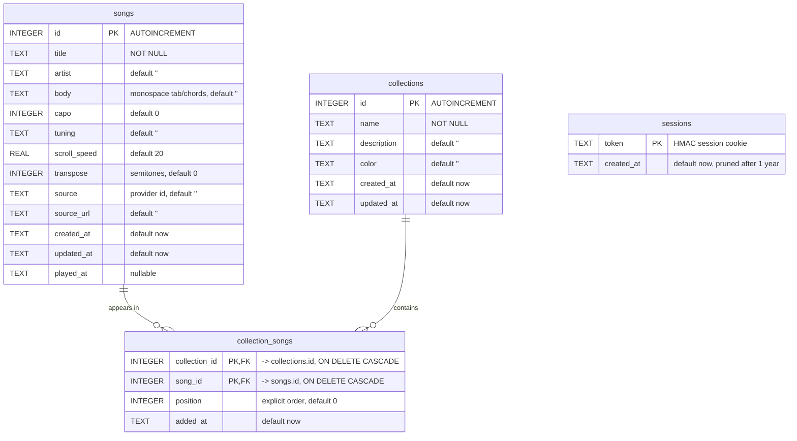

# OpenTabs 🎸

Your own open-source tab and chords library: store your tabs, read them with
autoscroll on your phone, search and import from online sources, self-host it
anywhere. Built as a personal alternative to Ultimate Guitar.

## Features

- **Library** with instant search (title, artist), sorted by recently played.
- **Reader** optimized for phones: chord highlighting, autoscroll with per-song
  speed, transpose (persisted per song), capo/tuning display, font size control,
  screen wake lock so the phone doesn't sleep mid-song.
- **Editor**: plain monospace text (paste straight from Ultimate Guitar; `[ch]`
  and `[tab]` markers are cleaned on import), live preview.
- **Search online**: pluggable tab sources. Ships with an Ultimate Guitar
  provider (search + one-tap import into your library). Add your own in
  `server/sources/` (see `provider.md`).
- **PWA**: installable on iOS/Android ("Add to Home Screen"), offline reading of
  cached songs.
- **Single container**: Node + SQLite, trivial to migrate between hosts (copy
  `data/opentabs.db`).

## Data model

Everything lives in a single SQLite file (`data/opentabs.db`). Four tables:
`songs`, `collections`, the `collection_songs` join table (ordered
many-to-many), and `sessions` for auth. The `foreign_keys` pragma is ON, so
deleting a song or a collection cascades to its membership rows.



`sessions` stands alone (no foreign keys): it just records valid auth cookies
and is unused when `OPENTABS_PASSWORD` is not set.

## Run locally

```bash
npm install
npm start          # http://localhost:3000, auth disabled
```

Set a password to enable auth:

```bash
OPENTABS_PASSWORD=mysecret npm start
```

## Run with Docker

```bash
OPENTABS_PASSWORD=mysecret docker compose up --build
```

Songs are stored in `./data/opentabs.db`. Back that file up and you've backed
up everything. To migrate hosts, copy the file and start the container there.

## Use it on iPhone

1. Deploy somewhere reachable (VPS, Fly.io, home server + Tailscale, ...).
   Use HTTPS in production: put it behind Caddy/Traefik/nginx or your host's TLS.
2. Open the URL in Safari, log in, Share → **Add to Home Screen**.
3. Open a song, hit ▶: autoscroll starts and the screen stays awake.

## Notes on the Ultimate Guitar source

The UG provider parses the public HTML pages of ultimate-guitar.com for
personal use. It depends on their page structure and can break without notice;
official/Pro tabs are not importable. Be a good citizen: this is for your own
library, not for redistribution.

## License

MIT
